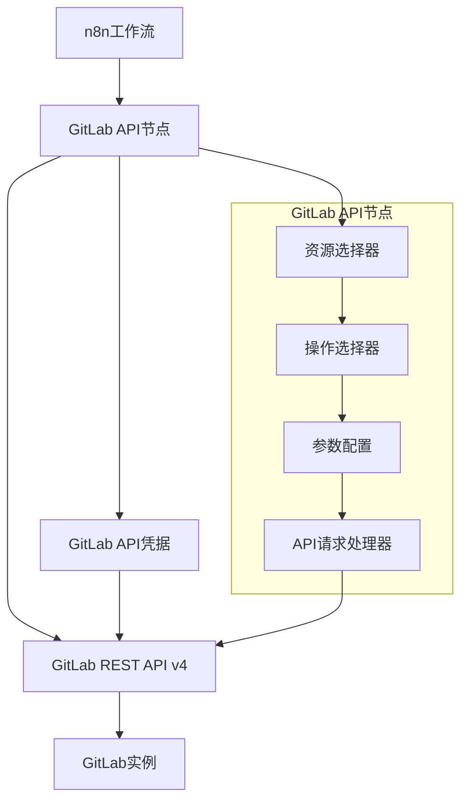

# 设计文档

## 概述

GitLab API节点是一个n8n社区节点，通过GitLab REST API v4与GitLab实例进行交互。该节点将提供核心功能：认证配置、项目信息获取、合并请求列表和详情获取。设计遵循n8n社区节点标准，确保与n8n工作流平台的无缝集成。

## 架构

### 高层架构



### 技术栈

- **TypeScript**: 主要开发语言
- **n8n-workflow**: n8n节点开发框架
- **GitLab REST API v4**: 数据源
- **Personal Access Token**: 认证方式

## 组件和接口

### 1. GitLab API凭据 (GitLabApi.credentials.ts)

**职责**: 管理GitLab实例连接和认证信息

**接口设计**:
```typescript
interface IGitLabCredentials {
  domain: string;        // GitLab实例URL
  accessToken: string;   // 个人访问令牌
}
```

**属性**:
- `domain`: GitLab实例URL (例如: https://gitlab.com 或 https://gitlab.example.com)
- `accessToken`: 个人访问令牌，用于API认证

**认证方式**:
- 使用HTTP Header: `PRIVATE-TOKEN: <access_token>`
- 支持自定义GitLab实例域名

**测试端点**:
- `GET /api/v4/user` - 验证令牌有效性和用户权限

### 2. GitLab API节点 (GitLab.node.ts)

**职责**: 提供GitLab API操作的用户界面和业务逻辑

**资源结构**:
```typescript
enum GitLabResource {
  PROJECT = 'project',
  MERGE_REQUEST = 'mergeRequest'
}
```

**操作结构**:
```typescript
enum ProjectOperation {
  GET = 'get'
}

enum MergeRequestOperation {
  GET_ALL = 'getAll',
  GET = 'get'
}
```

### 3. API请求处理器

**基础配置**:
- Base URL: `{domain}/api/v4`
- 认证: `PRIVATE-TOKEN` header
- 内容类型: `application/json`
- 接受类型: `application/json`

## 数据模型

### 1. 项目数据模型

```typescript
interface IProject {
  id: number;
  name: string;
  description: string;
  web_url: string;
  created_at: string;
  last_activity_at: string;
  namespace: {
    id: number;
    name: string;
    path: string;
  };
  path: string;
  path_with_namespace: string;
  default_branch: string;
  visibility: 'private' | 'internal' | 'public';
}
```

### 2. 合并请求数据模型

```typescript
interface IMergeRequest {
  id: number;
  iid: number;
  project_id: number;
  title: string;
  description: string;
  state: 'opened' | 'closed' | 'merged';
  created_at: string;
  updated_at: string;
  target_branch: string;
  source_branch: string;
  author: {
    id: number;
    name: string;
    username: string;
    web_url: string;
  };
  assignee?: {
    id: number;
    name: string;
    username: string;
    web_url: string;
  };
  labels: string[];
  web_url: string;
}
```

## API端点映射

### 1. 项目操作

| 操作 | HTTP方法 | 端点 | 描述 |
|------|----------|------|------|
| 获取项目 | GET | `/projects/{id}` | 通过项目ID获取项目详情 |

**参数**:
- `projectId` (string, required): 项目ID或项目路径 (例如: "1" 或 "group/project")

### 2. 合并请求操作

| 操作 | HTTP方法 | 端点 | 描述 |
|------|----------|------|------|
| 获取MR列表 | GET | `/projects/{id}/merge_requests` | 获取项目的合并请求列表 |
| 获取MR详情 | GET | `/projects/{id}/merge_requests/{merge_request_iid}` | 获取单个合并请求详情 |

**获取MR列表参数**:
- `projectId` (string, required): 项目ID或项目路径
- `state` (string, optional): 筛选状态 ('opened', 'closed', 'merged', 'all')
- `per_page` (number, optional): 每页结果数量 (默认: 20, 最大: 100)
- `page` (number, optional): 页码 (默认: 1)

**获取MR详情参数**:
- `projectId` (string, required): 项目ID或项目路径
- `mergeRequestIid` (number, required): 合并请求的内部ID (IID)

## 错误处理

### 1. 认证错误

- **401 Unauthorized**: 访问令牌无效或过期
- **403 Forbidden**: 令牌权限不足

**处理策略**:
- 提供清晰的错误信息
- 建议检查令牌有效性和权限
- 提供文档链接指导令牌创建

### 2. 资源错误

- **404 Not Found**: 项目或合并请求不存在
- **400 Bad Request**: 请求参数无效

**处理策略**:
- 验证输入参数格式
- 提供具体的错误描述
- 建议正确的参数格式

### 3. 网络错误

- **连接超时**: GitLab实例不可达
- **DNS解析失败**: 域名配置错误

**处理策略**:
- 检查域名配置
- 验证网络连接
- 提供重试机制

## 测试策略

### 1. 单元测试

**凭据测试**:
- 验证凭据属性配置
- 测试认证头生成
- 验证测试端点调用

**节点测试**:
- 验证资源和操作配置
- 测试参数验证逻辑
- 验证API请求构建

### 2. 集成测试

**API集成测试**:
- 测试真实GitLab实例连接
- 验证各种API端点响应
- 测试错误场景处理

**n8n集成测试**:
- 验证节点在n8n工作流中的行为
- 测试数据流传递
- 验证输出格式

### 3. 端到端测试

**工作流测试**:
- 创建完整的测试工作流
- 验证实际使用场景
- 测试性能和稳定性

## 安全考虑

### 1. 令牌安全

- 使用n8n的密码字段类型存储访问令牌
- 不在日志中记录敏感信息
- 支持令牌轮换

### 2. 输入验证

- 验证所有用户输入
- 防止注入攻击
- 限制请求频率

### 3. 错误信息

- 不在错误信息中暴露敏感数据
- 提供安全的错误描述
- 记录安全相关事件

## 性能优化

### 1. 请求优化

- 使用适当的分页参数
- 实现请求缓存机制
- 支持批量操作

### 2. 数据处理

- 优化JSON解析
- 减少内存使用
- 支持流式处理大数据

### 3. 错误恢复

- 实现指数退避重试
- 处理速率限制
- 提供优雅降级