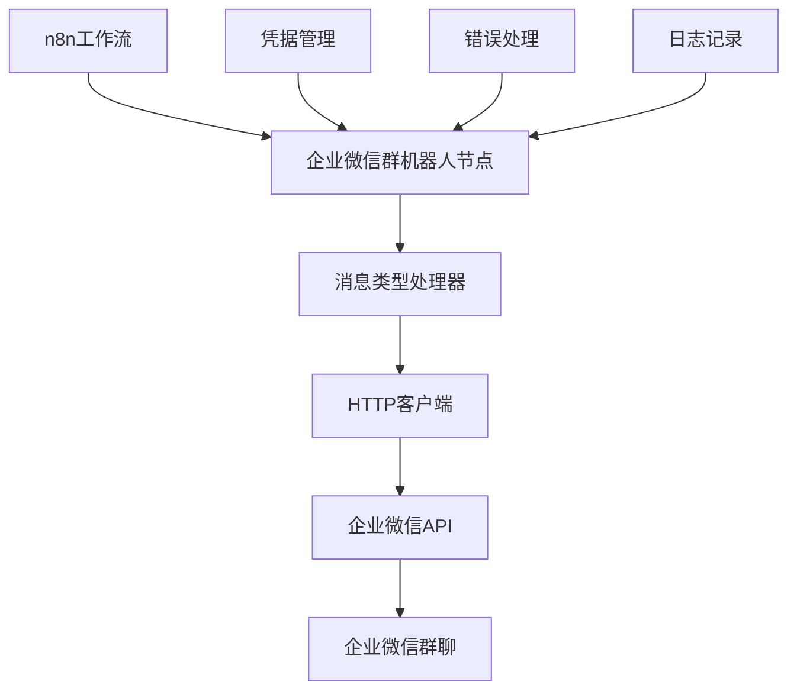

# 企业微信群机器人通知节点设计文档

## 概述

企业微信群机器人通知节点是一个n8n自定义节点，用于向企业微信群聊发送各种类型的消息通知。该节点通过企业微信群机器人的webhook API实现消息推送功能，支持文本、Markdown、图片、图文和文件等多种消息类型。

## 架构

### 整体架构



### 核心组件

1. **节点主类 (WeworkBotNotification)**
   - 实现INodeType接口
   - 处理节点配置和执行逻辑
   - 管理消息类型分发

2. **消息处理器 (MessageHandler)**
   - 文本消息处理器
   - Markdown消息处理器
   - 图片消息处理器
   - 图文消息处理器
   - 文件消息处理器

3. **HTTP客户端 (ApiClient)**
   - 封装企业微信API调用
   - 处理请求重试和超时
   - 统一错误处理

4. **凭据类型 (WeworkBotApi)**
   - 管理webhook URL
   - 提供连接测试功能

## 组件和接口

### 节点类结构

```typescript
export class WeworkBotNotification implements INodeType {
  description: INodeTypeDescription = {
    displayName: '企业微信群机器人',
    name: 'weworkBotNotification',
    icon: { light: 'file:wework.svg', dark: 'file:wework.svg' },
    group: ['communication'],
    version: 1,
    subtitle: '={{$parameter["messageType"]}}',
    description: '向企业微信群发送通知消息',
    defaults: {
      name: '企业微信群机器人',
    },
    inputs: ['main'],
    outputs: ['main'],
    credentials: [
      {
        name: 'weworkBotApi',
        required: true,
      },
    ],
    properties: [
      // 节点属性配置
    ],
  };

  async execute(this: IExecuteFunctions): Promise<INodeExecutionData[][]> {
    // 执行逻辑
  }
}
```

### 凭据类结构

```typescript
export class WeworkBotApi implements ICredentialType {
  name = 'weworkBotApi';
  displayName = '企业微信群机器人API';
  documentationUrl = 'https://developer.work.weixin.qq.com/document/path/91770';
  
  properties: INodeProperties[] = [
    {
      displayName: 'Webhook URL',
      name: 'webhookUrl',
      type: 'string',
      default: '',
      required: true,
      description: '企业微信群机器人的Webhook URL',
    },
  ];

  authenticate: IAuthenticateGeneric = {
    type: 'generic',
    properties: {},
  };

  test: ICredentialTestRequest = {
    request: {
      baseURL: '={{$credentials.webhookUrl}}',
      method: 'POST',
      body: {
        msgtype: 'text',
        text: {
          content: '连接测试成功',
        },
      },
    },
  };
}
```

### 消息类型接口

```typescript
interface BaseMessage {
  msgtype: string;
}

interface TextMessage extends BaseMessage {
  msgtype: 'text';
  text: {
    content: string;
    mentioned_list?: string[];
    mentioned_mobile_list?: string[];
  };
}

interface MarkdownMessage extends BaseMessage {
  msgtype: 'markdown';
  markdown: {
    content: string;
  };
}

interface ImageMessage extends BaseMessage {
  msgtype: 'image';
  image: {
    base64: string;
    md5: string;
  };
}

interface NewsMessage extends BaseMessage {
  msgtype: 'news';
  news: {
    articles: Array<{
      title: string;
      description?: string;
      url: string;
      picurl?: string;
    }>;
  };
}

interface FileMessage extends BaseMessage {
  msgtype: 'file';
  file: {
    media_id: string;
  };
}
```

## 数据模型

### 节点输入数据

```typescript
interface NodeInputData {
  messageType: 'text' | 'markdown' | 'image' | 'news' | 'file';
  content?: string;
  markdownContent?: string;
  imageBase64?: string;
  imageUrl?: string;
  newsArticles?: NewsArticle[];
  fileMediaId?: string;
  mentionedUsers?: string[];
  mentionedMobiles?: string[];
}

interface NewsArticle {
  title: string;
  description?: string;
  url: string;
  picurl?: string;
}
```

### 节点输出数据

```typescript
interface NodeOutputData {
  success: boolean;
  messageId?: string;
  errorCode?: number;
  errorMessage?: string;
  timestamp: number;
  messageType: string;
}
```

### API响应模型

```typescript
interface WeworkApiResponse {
  errcode: number;
  errmsg: string;
}

interface WeworkApiError extends Error {
  code: number;
  message: string;
  response?: any;
}
```

## 错误处理

### 错误类型分类

1. **网络错误**
   - 连接超时
   - 网络不可达
   - DNS解析失败

2. **认证错误**
   - Webhook URL无效
   - Webhook URL过期
   - 权限不足

3. **参数错误**
   - 消息内容为空
   - 消息格式不正确
   - 参数类型错误

4. **业务错误**
   - 消息内容过长
   - 图片格式不支持
   - 发送频率超限

### 错误处理策略

```typescript
class ErrorHandler {
  static handleApiError(error: any): WeworkApiError {
    const errorCode = error.response?.data?.errcode || -1;
    const errorMessage = error.response?.data?.errmsg || error.message;
    
    switch (errorCode) {
      case 93000:
        return new WeworkApiError(errorCode, 'Webhook URL无效或已过期');
      case 45009:
        return new WeworkApiError(errorCode, '接口调用超过限制');
      case 40001:
        return new WeworkApiError(errorCode, '参数错误');
      default:
        return new WeworkApiError(errorCode, errorMessage);
    }
  }

  static shouldRetry(error: WeworkApiError): boolean {
    // 网络错误和临时性错误可以重试
    return error.code === -1 || error.code === 45009;
  }
}
```

## 测试策略

### 单元测试

1. **消息处理器测试**
   - 测试各种消息类型的格式化
   - 测试参数验证逻辑
   - 测试错误处理

2. **API客户端测试**
   - 测试HTTP请求构建
   - 测试响应解析
   - 测试重试机制

3. **节点执行测试**
   - 测试不同输入数据的处理
   - 测试输出数据格式
   - 测试异常情况处理

### 集成测试

1. **API集成测试**
   - 测试与企业微信API的实际交互
   - 测试各种消息类型的发送
   - 测试错误响应处理

2. **n8n集成测试**
   - 测试节点在n8n环境中的运行
   - 测试与其他节点的数据传递
   - 测试凭据管理功能

### 测试用例设计

```typescript
describe('WeworkBotNotification', () => {
  describe('文本消息', () => {
    it('应该成功发送纯文本消息', async () => {
      // 测试用例实现
    });

    it('应该支持@提及用户', async () => {
      // 测试用例实现
    });

    it('应该验证消息长度限制', async () => {
      // 测试用例实现
    });
  });

  describe('Markdown消息', () => {
    it('应该正确处理Markdown格式', async () => {
      // 测试用例实现
    });

    it('应该验证Markdown语法', async () => {
      // 测试用例实现
    });
  });

  describe('错误处理', () => {
    it('应该正确处理网络错误', async () => {
      // 测试用例实现
    });

    it('应该正确处理API错误', async () => {
      // 测试用例实现
    });
  });
});
```

## 性能考虑

### 请求优化

1. **连接复用**
   - 使用HTTP Keep-Alive
   - 复用HTTP连接池

2. **请求压缩**
   - 启用gzip压缩
   - 减少传输数据量

3. **超时设置**
   - 合理设置连接超时
   - 设置读取超时

### 内存管理

1. **大文件处理**
   - 流式处理大图片
   - 避免内存溢出

2. **缓存策略**
   - 缓存媒体文件MD5
   - 避免重复计算

## 安全考虑

### 数据安全

1. **敏感信息保护**
   - Webhook URL加密存储
   - 避免日志中泄露敏感信息

2. **输入验证**
   - 严格验证所有输入参数
   - 防止注入攻击

3. **传输安全**
   - 强制使用HTTPS
   - 验证SSL证书

### 访问控制

1. **权限验证**
   - 验证Webhook URL有效性
   - 检查发送权限

2. **频率限制**
   - 实现客户端限流
   - 避免API调用超限

## 配置管理

### 节点属性配置

```typescript
const nodeProperties: INodeProperties[] = [
  {
    displayName: '消息类型',
    name: 'messageType',
    type: 'options',
    options: [
      { name: '文本消息', value: 'text' },
      { name: 'Markdown消息', value: 'markdown' },
      { name: '图片消息', value: 'image' },
      { name: '图文消息', value: 'news' },
      { name: '文件消息', value: 'file' },
    ],
    default: 'text',
    required: true,
  },
  {
    displayName: '消息内容',
    name: 'content',
    type: 'string',
    typeOptions: {
      rows: 4,
    },
    displayOptions: {
      show: {
        messageType: ['text'],
      },
    },
    default: '',
    required: true,
    description: '要发送的文本消息内容',
  },
  // 其他属性配置...
];
```

### 环境配置

```typescript
interface NodeConfig {
  maxRetries: number;
  retryDelay: number;
  timeout: number;
  maxContentLength: number;
  maxImageSize: number;
  supportedImageTypes: string[];
}

const defaultConfig: NodeConfig = {
  maxRetries: 3,
  retryDelay: 1000,
  timeout: 30000,
  maxContentLength: 4096,
  maxImageSize: 2 * 1024 * 1024, // 2MB
  supportedImageTypes: ['jpg', 'jpeg', 'png'],
};
```

## 部署和维护

### 构建配置

1. **TypeScript编译**
   - 编译到ES2019目标
   - 生成CommonJS模块

2. **资源处理**
   - 复制图标文件
   - 处理静态资源

3. **代码检查**
   - ESLint规则检查
   - Prettier格式化

### 版本管理

1. **语义化版本**
   - 遵循SemVer规范
   - 明确版本兼容性

2. **变更日志**
   - 记录功能变更
   - 记录破坏性变更

### 监控和日志

1. **执行监控**
   - 记录执行时间
   - 记录成功/失败率

2. **错误追踪**
   - 详细错误日志
   - 错误堆栈信息

3. **性能指标**
   - API响应时间
   - 内存使用情况